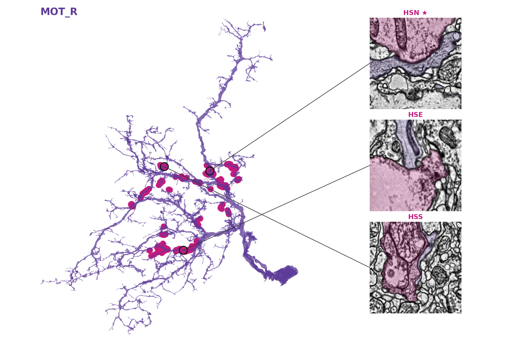
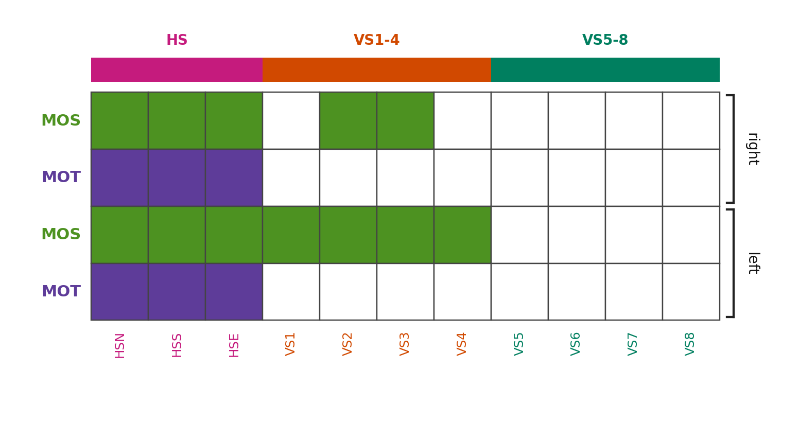

# MESH — find and proofread neuron–neuron contacts in EM connectomes

**MESH answers a question that is otherwise tedious to ask of a connectome: *where do these two neurons actually touch, and what does that contact look like in the electron microscope?***

Chemical synapses in FlyWire/FAFB are annotated and searchable. **Gap junctions are not** — they are invisible to every existing automated detector. Anyone hunting for electrical coupling, or for any non-synaptic apposition, is left scrolling manually through EM. MESH automates the search: it finds every place where a set of neurons come within a chosen distance of one another, validates those contacts against the segmentation, cuts the matching EM image stacks, and opens the result in a browser where you can page through the sites, measure them, and throw out the ones that are not real.

It is a general tool. You give it a list of segment IDs; it gives you their contacts, the EM to judge them by, and a proofreading loop that makes your judgements stick.

> **Which version is this?**
> This is the **publication build**: contact detection, segmentation validation,
> EM proofreading, measurement and gap-junction candidate ranking.
> `neurons.json` ships with the 26 cells used in the paper, but that is only a
> default — the pipeline reads every neuron from the config, so swapping in or
> adding cells is a config edit, not a code change. See
> [Using MESH on your own neurons](#using-mesh-on-your-own-neurons).
>
> Development continues at
> [github.com/ETigerschuss/MESH](https://github.com/ETigerschuss/MESH), where the
> same tool additionally carries a biophysical circuit model (Hodgkin-Huxley
> LPTC–motor-neuron simulation with gap junctions and chemical synapses) and an
> eye-movement readout. Use that version if you want the modelling.



*A MOT motor neuron (purple) with the sites where it contacts HS cells, and the EM at three of them. Figures like this are generated by the pipeline.*

## What it does

| Step | What happens |
|---|---|
| **Find** | Downloads meshes for your neurons from FlyWire and finds every pairwise contact within a distance threshold (default **100 nm**) using a k-d tree. |
| **Separate** | Groups contacts into anatomically distinct sites by Ward clustering (split at **10 µm**), so each apposition is inspected on its own. |
| **Validate** | Re-checks each site against the segmentation (dilate one cell's mask, intersect with the partner) — mesh proximity over-reports contact by ~30%, and this removes it. |
| **Look** | Cuts EM tiles (512 × 512 px at 8 nm/px = 4.1 µm) centred on each site, across ±20 sections, with both partners' segmentation overlaid. |
| **Judge** | Opens an interactive 3-D + EM viewer: page through sites, measure appositions, delete false positives, mark confirmed gap junctions. |
| **Persist** | `apply_proofreading.py` writes your deletions back into the dataset, so removed areas stay removed. |

**Optional:** subtract annotated chemical synapses to leave only candidate *electrical* contacts (`phase_a_gj_candidates.py`).

## Why the validation step matters

The geometric detector flags mesh *proximity*. Two membranes can lie close without touching, so raw overlap over-counts contact. Checking each site against the segmentation is what separates a real apposition from a near-miss:

| | Mesh proximity | Seg-validated |
|---|---|---|
| Total motor↔LPTC contact area | 389 µm² | **272 µm² (70%)** |
| Weakest pair (MOS_L↔HSS_L) | 1.8 µm² | **0 µm² — not a real contact** |
| Strongest pair (MOT_R↔HSN_R) | 87.9 µm² | 69.6 µm² (79% real) |

Without this step, roughly a third of the "contact" you would report — and, in some pairs, all of it — is an artifact of mesh proximity.



## Key features
- Pairwise contact detection at a configurable distance threshold, in both directions
- **Spatial clustering** so disconnected contact regions become separate, independently reviewable entries
- **Segmentation validation** of every site, with confined areas reported per pair
- Interactive 3-D HTML viewer (Plotly) with an EM panel, Z-stack navigation and contrast control
- **Measurement tool** — trace an apposed membrane and read length/area directly (8 nm/px, 40 nm sections)
- **Proofreading that persists** — deletions are applied back to the dataset, not just logged
- Publication-ready figures (skeleton + contact sites + EM insets) as PNG and PDF
- 2D skeleton projection plots, with contacts painted at their true size on the membrane
- **Graveyard** — rejected EM images are moved aside, not deleted, and can be revived

## Pipeline Scripts

Run all scripts in order with **`python run_all.py`**, or run individually:

| # | Script | Description |
|---|--------|-------------|
| 1 | **`overlap_analysis.py`** | Core analysis: downloads the configured neurons' meshes from FlyWire, computes all pairwise contacts at the 0.1 µm threshold, identifies contact patches and chemical synapses. Saves to `comprehensive_overlap_results_YYYY-MM-DD/`: `all_results_combined.csv`, `synapses.csv`, `geometric_data/contact_faces.csv`, `contact_vertices.csv`, overlap matrices and 3D Plotly figures. Runtime: ~2 h first run (mesh download), ~30 min cached. |
| 2 | **`validate_overlaps.py`** | Validates each contact against the segmentation (dilate one cell's mask by 3 voxels ≈ 48 nm, intersect with the partner). Writes `overlap_validation.json` (per-pair real fraction + confined area) and `validated_patches.csv` (the genuinely apposed sites). |
| 3 | **`reduced_matrix.py`** | Compact binary contact matrix (motor rows × LPTC-type columns) as PNG/SVG. |
| 4 | **`generate_skeleton_plots.py`** | 2D projection plots of neuron skeletons with contact sites highlighted — one per pair, plus summary scenarios. |
| 5 | **`generate_em_stacks.py`** | Downloads EM tiles with coloured segmentation overlays via CloudVolume. Spatially clusters contacts per pair (10 µm, `scipy.cluster.hierarchy`) so disconnected regions get separate indices, then cuts ±20 slice Z-stacks for overlaps, contact patches and synapses. Writes `overlap_em_meta.json`. Timeout/retry logic (60 s, 3 attempts, exponential back-off). Set `MESH_EM_WORKERS` for concurrency; `MESH_OVERLAP_FILTER=motor_lptc` to fetch only motor↔LPTC contacts. |
| 6 | **`generate_gj_figures.py`** | Publication figures: skeleton + contact sites + EM insets with connector lines (PNG + PDF), compact and extended layouts. |
| 7 | **`skeleton_em_viewer.py`** | Builds the self-contained HTML viewer — 3D scene, EM panel with Z-slider, measurement tool, deletion buttons, area matrix and candidate markers. Reads `overlap_em_meta.json` and `em_snaps/`. **Run last.** |

**Post-hoc tools** (not part of the batch run):

| Script | Purpose |
|--------|---------|
| **`apply_proofreading.py`** | Applies viewer deletions/confirmations back to the dataset so removed areas stay removed. See [proofreading workflow](#proofreading-workflow--removing-areas-for-good). |
| **`phase_a_gj_candidates.py`** | Subtracts annotated chemical synapses from the validated contacts to yield ranked gap-junction candidates (`gj_candidates.csv`). |
| **`generate_gj_figures_extended.py`** | Renders a figure for one specific site: `python generate_gj_figures_extended.py <vx> <vy> <vz>`. |

### Supporting files

| File | Description |
|------|-------------|
| **`neurons.json`** | Central neuron configuration — FlyWire IDs, names, groups, RGB colours. All scripts read from this single file (no hardcoded neuron lists). |
| **`run_all.py`** | Orchestrator — runs all 4 pipeline scripts in sequence, auto-loads FlyWire token from `cave-secret.json`. |
| **`requirements.txt`** | Python dependencies. |

### Config profiles

`neurons.json` is the default set (the 26 cells used in the paper). To run a
different set of neurons, write your own config and point the pipeline at it:

```bash
python run_all.py --config path/to/my_neurons.json
```

Or set it once in the environment:

```bash
# Windows PowerShell
$Env:MESH_NEURON_CONFIG = "C:\path\to\my_neurons.json"
python run_all.py
```

Pair a config with its own results directory so runs stay separate:

```bash
python run_all.py --config my_neurons.json --results-dir results_my_neurons
```

Omit both and the pipeline uses `neurons.json`.

A config needs, per neuron: the FlyWire segment `id`, a `group`, and colours
(`color_hex`, `color_rgb`). `synapse_groups` selects which groups get chemical
synapses loaded, `viewer_neurons` which appear in the HTML viewer, and
`pairing_rules` which pairs are tested for contact. Copy `neurons.json` and edit
it — see [Using MESH on your own neurons](#using-mesh-on-your-own-neurons).

## Color Palette

| Group | Color | Hex |
|-------|-------|-----|
| MOT | Purple | `#5E3C99` |
| MOS | Green | `#4D9221` |
| VS | Orange | `#D14900` |
| HS | Magenta | `#C51B7D` |

Colors are defined per neuron in `neurons.json` and are used for the 3D meshes, the overlap areas painted on them, and the EM segmentation overlays.

## Requirements

### Python

Python 3.10+ (tested with 3.13). Install dependencies:

```bash
pip install -r requirements.txt
```

Core packages: `numpy`, `pandas`, `plotly`, `Pillow`, `navis`, `fafbseg`, `cloud-volume`, `trimesh`, `matplotlib`, `scipy`, `tqdm`

### FlyWire CAVE Token

Required for mesh download and EM data access. Set **before** running:

```bash
# Linux / macOS
export FLYWIRE_TOKEN="your_token_here"

# Windows PowerShell
$Env:FLYWIRE_TOKEN = "your_token_here"
```

Alternatively, place the token in `~/.cloudvolume/secrets/cave-secret.json`:
```json
{"token": "your_token_here"}
```

`run_all.py` will auto-load it from there.

Obtain a token from the [FlyWire CAVE portal](https://global.daf-apis.com/info/).

### Internet Connection

First run downloads ~1.4 GB of neuron meshes + ~3,400 overlap EM snapshots + contact/synapse stacks. Subsequent runs use cached data and skip existing images.

## Installation

### Quick setup from GitHub

```bash
git clone https://github.com/ETigerschuss/MESH.git
cd MESH

# Recommended: create an isolated virtual environment
python -m venv venv
source venv/bin/activate        # Linux / macOS
venv\Scripts\activate.bat       # Windows (Command Prompt)
# or:
venv\Scripts\Activate.ps1       # Windows (PowerShell)

pip install -r requirements.txt
```

### Obtain a FlyWire CAVE token

```bash
# Visit https://global.daf-apis.com/info/ to get your token, then:

# Option A — environment variable (must be set each session):
export FLYWIRE_TOKEN="your_token_here"   # Linux/macOS
$Env:FLYWIRE_TOKEN = "your_token_here"  # Windows PowerShell

# Option B — persistent secret file (loaded automatically by run_all.py):
mkdir -p ~/.cloudvolume/secrets
echo '{"token": "your_token_here"}' > ~/.cloudvolume/secrets/cave-secret.json
```

### Run the pipeline

```bash
python run_all.py          # Full pipeline (Steps 1-4 in sequence)
```

This will:
1. Download neuron meshes from FlyWire (~1.4 GB, first run only)
2. Compute pairwise overlaps and save results
3. Download EM snapshot stacks (~3,400 images)
4. Generate the interactive HTML viewer

Then open `comprehensive_overlap_results_YYYY-MM-DD/skeleton_em_viewer.html` in Chrome or Firefox.

> **First run time:** ~2-3 hours (mesh + EM download). Subsequent runs: ~5-15 minutes (all cached).

## Usage

### Full pipeline

```bash
python run_all.py
```

### Individual scripts

```bash
python overlap_analysis.py        # Step 1: mesh download + overlap analysis
python generate_skeleton_plots.py # Step 2: 2D skeleton plots
python generate_em_stacks.py      # Step 3: EM snapshot download (+ spatial clustering)
python skeleton_em_viewer.py      # Step 4: generate HTML viewer
```

Then open `comprehensive_overlap_results_YYYY-MM-DD/skeleton_em_viewer.html` in a browser.

## Viewer Features

### Left Panel — Neuron Controls
- Toggle visibility per neuron (mesh, contacts, synapses, overlaps)
- Overlap area matrix with clickable cells

### Overlap Area Calculation

Overlap area is computed in Step 1 from the triangle mesh geometry, not from image pixels.

1. For each neuron pair, the script builds a `cKDTree` over one mesh and queries the other mesh for faces whose centroids lie within the chosen distance threshold.
2. Every overlapping triangle contributes its geometric face area.
3. The total overlap area for a pair is the sum of all accepted triangle-face areas, reported in µm².
4. Top patches are then ranked by connected area, and those per-face records are written to `geometric_data/contact_faces.csv`.

This means the matrix values are surface-area estimates on the FlyWire meshes. They are sensitive to mesh quality, proofreading state, and the chosen overlap threshold.

### Center Panel — 3D Scene
- Neuron meshes + overlap face triangles (Mesh3d)
- Contacts (red circles), synapses (yellow markers)
- Click any overlap face -> jumps to EM panel for that cluster
- Diamond-shaped 3D position indicator

### Right Panel — EM Snapshots
- Segmentation overlay (source + target neuron colours)
- Z-slider with per-cluster valid slices
- **Contrast slider** — interactively changes EM image contrast in the browser for easier membrane tracing
- **Delete Slice** — Remove false positives by deleting individual Z-slices
   - Area is **automatically recalculated** from the remaining valid slices in that spatial cluster
   - The current viewer uses proportional rescaling: `remaining area = original cluster area × (remaining slices / original slices)`
   - Pair totals are updated by summing across all spatial sub-clusters for that neuron pair
  - Supported for both **overlap and contact** types
  - Auto-advances to next valid slice after deletion
- **Delete All** — Eliminate an entire overlap cluster (all Z-slices at once)
  - Marks the cluster as eliminated in the area matrix
  - Useful for confirmed false positives
  - Made permanent by exporting and running `apply_proofreading.py` (see below)
- Previous / Next navigation across all visible items
- Download EM — Export current snapshot with coordinates in filename and metadata panel
   - The PNG export includes the current slice metadata and touching-cell labels burned into the image footer
   - The export path still needs one cleanup pass so the downloadable data/annotation file is unambiguously expressed in FlyWire global coordinates

#### Proofreading workflow — removing areas for good

Deleting inside the viewer changes what *that browser session* shows. To make a
removal permanent — so the area is gone from the metadata, its EM images are
deleted, and it never comes back when the viewer is rebuilt — export your
decisions and apply them:

1. Open the EM panel for a contact and scroll the Z-slices.
2. **Delete Slice** for individual bad sections (scanning artifacts, retracted
   branches); **Delete All** when the whole contact is a false positive.
   The area matrix updates live as you go.
3. Mark real gap junctions with **⚡ Putative Gap-Junc**.
4. Click **💾 Export** → saves `viewer_annotations.json` (your deletions +
   confirmed gap junctions).
5. Apply it to the dataset:

```bash
python apply_proofreading.py                 # preview what would change
python apply_proofreading.py --dry-run       # ...without changing anything
```

   It finds the newest `viewer_annotations.json` (results dir or `~/Downloads`),
   backs up everything it touches (`*.bak_<timestamp>`), then:
   - removes deleted clusters from `overlap_em_meta.json`
   - deletes their `em_snaps/overlap_<idx>_*` images from disk
   - drops any gap-junction candidates inside a deleted area
   - prunes individual deleted Z-slices from their cluster
   - appends confirmed sites to `confirmed_gj.csv`
   - logs every run to `proofreading_applied.log`

6. Rebuild the viewer so it reflects the cleaned dataset:

```bash
python skeleton_em_viewer.py
```

The deleted areas are now gone from the viewer, the candidate list and any
figures you regenerate. Because originals are backed up, a proofreading pass can
always be rolled back.

## Project Structure

```
MESH/
├── mesh_config.py                # Config loader + coordinate conventions
├── run_all.py                    # Pipeline orchestrator
├── overlap_analysis.py           # 1. Contact detection
├── validate_overlaps.py          # 2. Segmentation validation
├── reduced_matrix.py             # 3. Compact contact matrix
├── generate_skeleton_plots.py    # 4. 2D skeleton plots
├── generate_em_stacks.py         # 5. EM download + spatial clustering
├── generate_gj_figures.py        # 6. Publication figures
├── skeleton_em_viewer.py         # 7. HTML viewer generator
├── apply_proofreading.py         # Persist viewer deletions
├── phase_a_gj_candidates.py      # Chemical-synapse subtraction
├── docs/figures/                 # README figures
├── requirements.txt              # Python dependencies
└── README.md                     # This file

Generated outputs (not in repository):
comprehensive_overlap_results_YYYY-MM-DD/
├── skeleton_em_viewer.html       # Interactive viewer (open in browser)
├── all_results_combined.csv      # Contact patch data
├── synapses.csv                  # Chemical synapse coordinates
├── overlap_validation.json       # Per-pair real fraction + confined area
├── validated_patches.csv         # Genuinely apposed contact sites
├── gj_candidates.csv             # Ranked gap-junction candidates
├── confirmed_gj.csv              # Sites you confirmed while proofreading
├── overlap_em_meta.json          # Contact cluster metadata
├── geometric_data/               # contact_faces.csv, contact_vertices.csv
├── em_snaps/                     # EM PNG snapshots (large)
├── neuron_meshes/                # OBJ files (large)
├── gj_figures/                   # Publication figures (PNG + PDF)
└── skeleton_plots/               # 2D skeleton PNGs
```

## Using MESH on your own neurons

MESH is not specific to motor neurons or LPTCs — it works on any set of FlyWire
segment IDs. To study a different circuit, edit one file.

**1. Write a config.** Copy `neurons.json` and replace the
entries with your cells. Each needs a FlyWire root ID, a group, and a colour:

```json
{
  "neurons": {
    "MyCell_L": { "id": 720575940622831740, "group": "TYPE_A",
                  "color_hex": "#5E3C99", "color_rgb": [94, 60, 153] },
    "Partner_L": { "id": 720575940640722851, "group": "TYPE_B",
                  "color_hex": "#4D9221", "color_rgb": [77, 146, 33] }
  },
  "pairing_rules": [{ "sources": ["TYPE_A"], "targets": ["TYPE_B"] }]
}
```

`pairing_rules` controls which group pairs are tested — leave it out to test all
pairs. Cells of the same colour are automatically distinguished in EM overlays
(one is drawn in its complementary colour).

**2. Run it.**

```bash
python run_all.py --config my_neurons.json
```

**3. Tune what matters for your question** (all in the scripts' constants):

| Parameter | Where | Default | Meaning |
|---|---|---|---|
| Contact distance | `overlap_analysis.py` `THRESHOLDS_MICRONS` | 0.1 µm | how close counts as contact |
| Site separation | `generate_em_stacks.py` `CLUSTER_THRESHOLD_NM` | 10 µm | when contacts become separate sites |
| Validation tolerance | `validate_overlaps.py` `DILATE_PX` | 3 px (~48 nm) | segmentation adjacency |
| EM crop size | `generate_em_stacks.py` `size_pixels` | 512 px (4.1 µm) | field of view per image |
| Z-range | `generate_em_stacks.py` | ±20 slices (±800 nm) | stack depth |

**Other EM datasets.** The geometry and viewer are dataset-agnostic; the mesh
source (`fafbseg`) and the EM/segmentation CloudVolume paths in
`generate_em_stacks.py` are the FlyWire-specific parts. Point those at another
precomputed volume and update the resolutions to adapt it.

## Dataset Information

- **FlyWire dataset:** FAFB v141 (flywire_783)
- **EM volume:** `https://bossdb-open-data.s3.amazonaws.com/flywire/fafbv14` (MIP 1, 8x8x40 nm)
- **Segmentation:** `precomputed://gs://flywire_v141_m783` (MIP 0, 16x16x40 nm)
- **Chemical synapse source:** FlyWire / CAVE synapse tables accessed through `fafbseg.flywire.synapses.get_synapses` on mat783-aligned data
- **Z-stack depth:** +/-20 slices (40 nm/slice = +/-800 nm total)
- **Snapshot size:** 512x512 px (4,096x4,096 nm)
- **Spatial clustering threshold:** 10 um (faces farther apart become separate overlap entries)

## Troubleshooting

| Problem | Solution |
|---------|----------|
| "FlyWire token missing" | Set `FLYWIRE_TOKEN` env var or place token in `~/.cloudvolume/secrets/cave-secret.json` |
| "No module named X" | `pip install -r requirements.txt` |
| CloudVolume connection errors | Check internet + Google Cloud Storage access; `pip install --upgrade cloud-volume` |
| Viewer shows no EM snapshots | Run `python generate_em_stacks.py` first, or check `em_snaps/` folder exists |
| HTML file too large to open | Normal — viewer is ~18 MB; use Chrome/Firefox |

## References And Provenance

### Connectomics Dataset And Infrastructure

- **FlyWire community reconstruction / data provenance:** Dorkenwald S. et al. (2023). *FlyWire: online community for whole-brain connectomics*. Nature.
- **FAFB EM volume:** Zheng Z. et al. (2018). *A Complete Electron Microscopy Volume of the Brain of Adult Drosophila melanogaster*. Cell.

### Chemical Synapses In This Repository

- The `synapses.csv` table is pulled from FlyWire/CAVE through `fafbseg.flywire.synapses.get_synapses`, not manually curated inside this repository.
- **These are not detected by MESH.** They are the automated synaptic-partner predictions of **Buhmann J. et al. (2021). *Automatic detection of synaptic partners in a whole-brain Drosophila electron microscopy data set*. Nature Methods 18, 771–774**, with cleft scores from Heinrich L. et al. (2018); cite that work when reporting chemical synapses obtained through this pipeline.
- **Gap junctions are not annotated by that method, or anywhere in FlyWire** — which is precisely why MESH exists: candidate electrical contacts have to be found geometrically and judged in EM.
- In practice, cite the FlyWire and FAFB papers above for the dataset provenance of those chemical synapse coordinates and counts.

### What Still Needs Tightening

- The downloadable annotation/data export should be normalized to explicit FlyWire global coordinates.

## Known Limitations

2. **Gap junctions are inferred from anatomy:** GJ sites are placed at the largest overlap region for each known pair. Functional confirmation (dye coupling, physiology) has not been performed for all pairs.
4. **Proofreading is applied in a separate step:** Deletions made in the viewer are session-local until you export `viewer_annotations.json` and run `apply_proofreading.py`, which writes them back to the dataset (with backups). Rebuild the viewer afterwards.
5. **Forward Euler integration:** dt = 0.01 ms is adequate for this model but numerical drift may accumulate in very long runs (> 10 s). Increase dt only if simulation time allows — action potentials require dt ≤ 0.025 ms.

## Extending the Pipeline

To add new neurons:
1. Add an entry to `neurons.json` with FlyWire ID, `color_hex`, `group`, and `hemibrain_id`
2. Add the neuron name to `viewer_neurons` and `synapse_groups` (if synapses should be loaded)
3. Add pairing rules in `pairing_rules` if needed
4. Re-run `python run_all.py` — the pipeline will skip cached meshes and only download the new neuron

To change the overlap distance threshold:
- Edit `THRESHOLDS_MICRONS` in `overlap_analysis.py`
